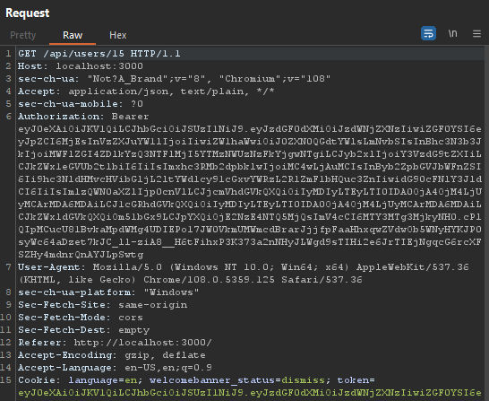
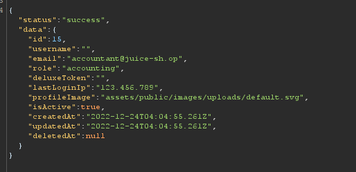
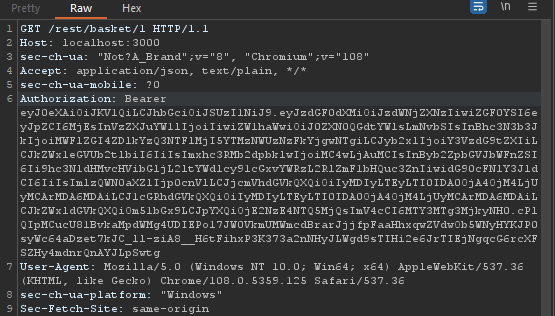
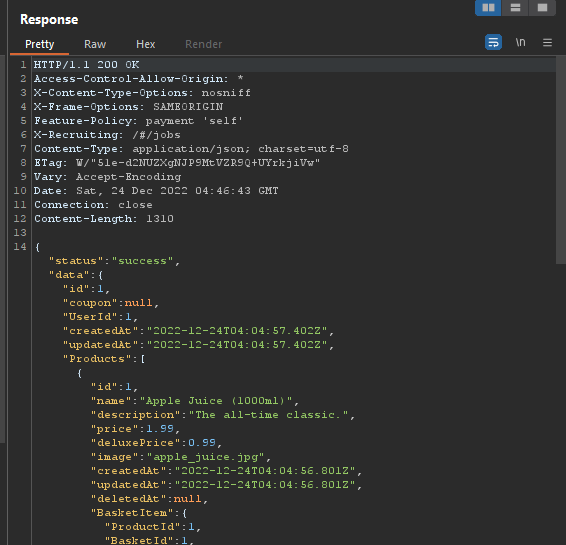
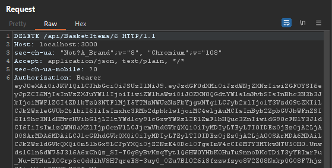
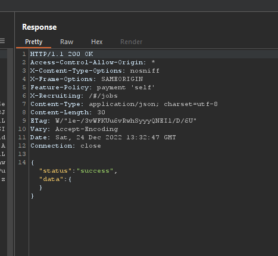
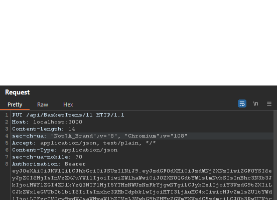
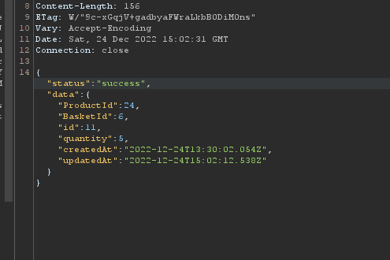

# Hacking OWASP Juice Shop

## Exploring IDOR

I found this endpoint

```
GET /api/users/{id}
```

which returns any user details by passing its ID,

Request


response


---

```
GET /api/basket/{id}
```

returns the basket based on given id, i am able to get some one else basket

Request


Response


---

```
DELETE /api/BasketItems/6
```

allows user to delete any item from cart/basket based on its ID,so i am able to delete some one else cart item

Request:



Response:


---

```
PUT /api/BasketItems/11
```

allows me to encrement the product quantity of someone else cart/basket

Request:


Response


---
